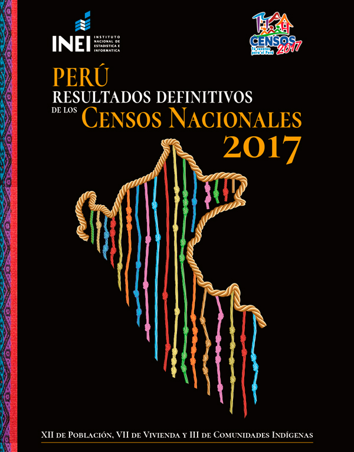

<!-- README.md is generated from README.Rmd. Please edit that file -->

# perucenso

## <a href='https://github.com/PaulESantos/perucenso'></a>

<!-- badges: start -->

[](https://lifecycle.r-lib.org/articles/stages.html#experimental)
[](https://CRAN.R-project.org/package=perucenso)
[](https://app.codecov.io/gh/PaulESantos/perucenso?branch=master)
<!-- badges: end -->

## Introducción

El paquete `perucenso` proporciona herramientas para el procesamiento y
análisis de los datos del `Censo Poblacional del Perú del año 2017`,
realizado por el Instituto Nacional de Estadística e Informática (INEI).
Este censo, recopiló información detallada sobre la población, viviendas
y comunidades indígenas en todo el país.

El INEI desplegó una monumental labor al ejecutar los Censos Nacionales
2017 en el Perú, con el propósito de recopilar datos actualizados y
detallados sobre la población, las viviendas y las comunidades
indígenas. En el marco de su política de difusión, el INEI presenta los
`Resultados Definitivos del departamento de Cusco`, un compendio extenso
y valioso que ofrece información relevante para instituciones públicas y
privadas, investigadores, estudiantes y el público en general.

El documento consta de quince tomos, abordando aspectos generales del
departamento, análisis de resultados, datos sobre población, vivienda y
hogar. Este esfuerzo estadístico ha sido posible gracias al apoyo de
diversas entidades y a la dedicación del personal del INEI.

Con el objetivo de facilitar el acceso y la manipulación de estos datos
para todos los departamentos del Perú, surge el paquete `perucenso`.
Aunque los datos utilizados inicialmente pertenecen al departamento de
Cusco, los códigos generados por este paquete serán aplicables a nivel
nacional, permitiendo un análisis más amplio y detallado de la
información censal. Este paquete busca ser una herramienta fundamental
para aquellos interesados en explorar y comprender la dinámica
demográfica y social del Perú.

## Instalación

Puedes instalar la versión de desarrollo de `perucenso` desde GitHub
puedes usar la siguinte función:

``` r
pak::pak("PaulESantos/perucenso")
```

#### Nota

- Es importante tener en cuenta que los datos se descargan desde la
  plataforma del
  [INEI](https://censo2017.inei.gob.pe/resultados-definitivos-de-los-censos-nacionales-2017/).
  Para generar las tablas ordenadas con la ayuda de `perucenso`, no es
  necesario modificar la estructura de los archivos Excel descargados.

- Las funciones que forman parte de `perucenso` actualmente están
  enfocadas en el aspecto poblacional, y se accede a ellas mediante
  `get_tab_1()`, `get_tab_2()`, …, `get_tab_10()`.

- La función `get_tab_1_salud()` es la primera función para ordenar los
  datos relacionados con el tema de salud.
