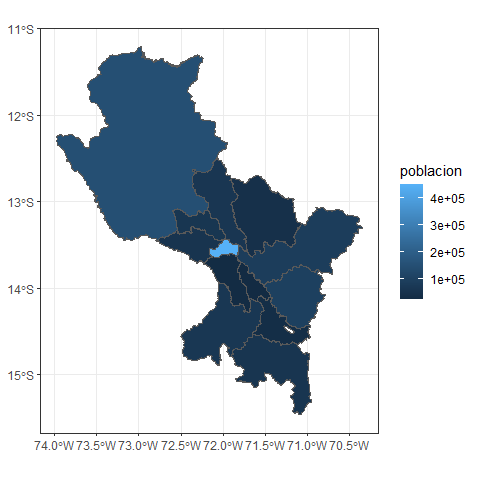
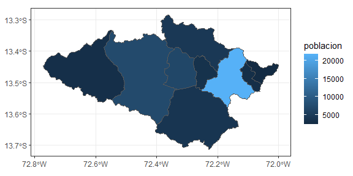

# Primeros pasos con perucenso


## Explorando Datos del Censo Peruano con el paquete `perucenso`

El año 2017 se desarrollo el censo nacional de vivienda por parte del
Instituto Nacional de Estadística e Informática (INEI) de Perú, dando
lugar a la generación de vastos volúmenes de datos sobre la población y
las características socioeconómicas del país. Para aprovechar esta
invaluable fuente de información, el paquete `perucenso` busca brindar
herramientas que faciliten el trabajo.

En este tutorial, exploraremos cómo utilizar las funciones del paquete
`perucenso` para organizar estos datos y crear visualizaciones.

### Importar los datos del TOMO I

``` r
#importar datos del tomo 1
cusco_path <- "https://raw.githubusercontent.com/PaulESantos/perugeopkg/master/inei/08TOMO_01_cusco.xlsx"

# guardar el archivo de forma temporal
 inei_file <- file.path(tempdir(), "data.xlsx")
try( silent = TRUE,
       httr::GET(url= cusco_path,
                 httr::write_disk(inei_file, overwrite = TRUE))
  )
#> Response [https://raw.githubusercontent.com/PaulESantos/perugeopkg/master/inei/08TOMO_01_cusco.xlsx]
#>   Date: 2024-02-26 04:08
#>   Status: 200
#>   Content-Type: application/octet-stream
#>   Size: 2.31 MB
#> <ON DISK>  C:\Users\paule\AppData\Local\Temp\RtmpG6cKFn\data.xlsx
```

Los datos presentados en el archivo Excel del Tomo I de los resultados
del censo están organizados en cinco hojas. En este tutorial, nos
enfocaremos en explorar los datos de la primera hoja.

``` r
library(readxl)
df <- read_xlsx(inei_file)
#> New names:
#> • `` -> `...2`
#> • `` -> `...3`
#> • `` -> `...4`
#> • `` -> `...5`
#> • `` -> `...6`
#> • `` -> `...7`
#> • `` -> `...8`
#> • `` -> `...9`
#> • `` -> `...10`
df
#> # A tibble: 14,648 × 10
#>    CUADRO Nº 1: POBLACIÓ…¹ ...2  ...3  ...4  ...5  ...6  ...7  ...8  ...9  ...10
#>    <chr>                   <chr> <chr> <chr> <chr> <chr> <chr> <chr> <chr> <chr>
#>  1 Provincia, distrito y … Total Pobl… <NA>  Total Urba… <NA>  Total Rural <NA> 
#>  2 <NA>                    <NA>  Homb… Muje… <NA>  Homb… Muje… <NA>  Homb… Muje…
#>  3 <NA>                    <NA>  <NA>  <NA>  <NA>  <NA>  <NA>  <NA>  <NA>  <NA> 
#>  4 DEPARTAMENTO CUSCO      1205… 5965… 6090… 7312… 3564… 3748… 4742… 2400… 2341…
#>  5 <NA>                    <NA>  <NA>  <NA>  <NA>  <NA>  <NA>  <NA>  <NA>  <NA> 
#>  6 Menores de 1 año        18706 9537  9169  11562 5911  5651  7144  3626  3518 
#>  7 De 1 a 4 años           83186 42490 40696 50276 25683 24593 32910 16807 16103
#>  8 1 año                   19181 9747  9434  11774 5974  5800  7407  3773  3634 
#>  9 2 años                  20452 10464 9988  12450 6390  6060  8002  4074  3928 
#> 10 3 años                  21393 10876 10517 12889 6548  6341  8504  4328  4176 
#> # ℹ 14,638 more rows
#> # ℹ abbreviated name:
#> #   ¹​`CUADRO Nº 1: POBLACIÓN CENSADA, POR ÁREA URBANA Y RURAL; Y SEXO, SEGÚN PROVINCIA, DISTRITO Y EDADES SIMPLES`
```

La estructura en la que se presentan estos datos no facilita su
manipulación de manera adecuada. Para generar una base de datos ordenada
de manera adecuada, nos apoyaremos en algunas funciones proporcionadas
por el paquete `perucenso`.

``` r
library(perucenso)
#> This is perucenso package 0.0.0.1
cusco <- perucenso::get_tab_1(inei_file, 
                              dep_name = "CUSCO")
```

La función `get_tab_1()` nos permite recuperar los datos de la tabla
titulada: ‘POBLACIÓN CENSADA, POR ÁREA URBANA Y RURAL; Y SEXO, SEGÚN
PROVINCIA, DISTRITO Y EDADES SIMPLES’. Esta función requiere dos
argumentos para su ejecución:

1.  `file`: corresponde a la ruta del archivo que estamos intentando
    leer.

2.  `dep_name`: debe contener el nombre del departamento del cual
    estamos recuperando la información. Por ejemplo, ‘CUSCO’.

``` r

cusco
#> # A tibble: 42,952 × 7
#>    departamento provincia distrito distribucion sexo  edad             poblacion
#>    <chr>        <chr>     <chr>    <chr>        <chr> <chr>                <dbl>
#>  1 CUSCO        CUSCO     CUSCO    urbano       varon Menores de 1 año       797
#>  2 CUSCO        CUSCO     CUSCO    urbano       mujer Menores de 1 año       777
#>  3 CUSCO        CUSCO     CUSCO    rural        varon Menores de 1 año        23
#>  4 CUSCO        CUSCO     CUSCO    rural        mujer Menores de 1 año        20
#>  5 CUSCO        CUSCO     CUSCO    urbano       varon 1 año                  794
#>  6 CUSCO        CUSCO     CUSCO    urbano       mujer 1 año                  738
#>  7 CUSCO        CUSCO     CUSCO    rural        varon 1 año                   22
#>  8 CUSCO        CUSCO     CUSCO    rural        mujer 1 año                   30
#>  9 CUSCO        CUSCO     CUSCO    urbano       varon 2 años                 901
#> 10 CUSCO        CUSCO     CUSCO    urbano       mujer 2 años                 801
#> # ℹ 42,942 more rows
```

Con la ayuda de esta herramienta, podemos realizar análisis
exploratorios y comprender cómo se distribuye la población en el
departamento de Cusco.

``` r
prov_cusco <- cusco |> 
  dplyr::group_by(provincia) |> 
  dplyr::summarise(poblacion = sum(poblacion, na.rm = TRUE))

prov_cusco
#> # A tibble: 13 × 2
#>    provincia     poblacion
#>    <chr>             <dbl>
#>  1 ACOMAYO           22940
#>  2 ANTA              56206
#>  3 CALCA             63155
#>  4 CANAS             32484
#>  5 CANCHIS           95774
#>  6 CHUMBIVILCAS      66410
#>  7 CUSCO            447588
#>  8 ESPINAR           57582
#>  9 LA CONVENCIÓN    147148
#> 10 PARURO            25567
#> 11 PAUCARTAMBO       42504
#> 12 QUISPICANCHI      87430
#> 13 URUBAMBA          60739
```

Recuperar la información por distrito.

``` r
dist_cusco <- cusco |> 
  dplyr::group_by(distrito) |> 
  dplyr::summarise(poblacion = sum(poblacion, na.rm = TRUE))

dist_cusco
#> # A tibble: 112 × 2
#>    distrito       poblacion
#>    <chr>              <dbl>
#>  1 ACCHA               3028
#>  2 ACOMAYO             4532
#>  3 ACOPÍA              2650
#>  4 ACOS                2242
#>  5 ALTO PICHIGUA       1934
#>  6 ANCAHUASI           6784
#>  7 ANDAHUAYLILLAS      5797
#>  8 ANTA               21674
#>  9 CACHIMAYO           2382
#> 10 CAICAY              2716
#> # ℹ 102 more rows
```

Podemos generar mapas para evaluar la variabilidad de los datos de
manera espacial con la ayuda del paquete `geoperu`, que nos brinda
acceso a la información espacial de los diferentes distritos del Perú.

``` r
library(geoperu)
#> This is geoperu 1.0.0
peru <- geoperu::distritos_peru |> 
  sf::st_as_sf()
# Informacion espacial de cusco
sf_cusco <- peru |> 
  dplyr::filter(departamento == "CUSCO") |> 
  dplyr::group_by(provincia) |> 
  dplyr::summarise(geometry = sf::st_union(geometry))

# Informacion del censo
prov_cusco <- cusco |> 
  dplyr::group_by(provincia) |> 
  dplyr::summarise(poblacion = sum(poblacion, na.rm = TRUE)) |> 
  dplyr::mutate(provincia = dplyr::if_else(provincia == "LA CONVENCIÓN",
                                           "LA CONVENCION",
                                           provincia) )

# Union de lso datos espaciales y censales
sf_cusco |> 
  dplyr::left_join(prov_cusco) |> 
  ggplot2::ggplot() +
  ggplot2::geom_sf(ggplot2::aes(fill = poblacion)) +
  ggplot2::theme_bw()
#> Joining with `by = join_by(provincia)`
```



Los datos para un provincia especifica.

``` r
anta <- peru |> 
  dplyr::filter(provincia == "ANTA")
anta_df <- cusco |> 
  dplyr::group_by(provincia, distrito) |> 
  dplyr::summarise(poblacion  = sum(poblacion, na.rm = TRUE)) |> 
  dplyr::ungroup() |> 
  dplyr::filter(provincia == "ANTA")
#> `summarise()` has grouped output by 'provincia'. You can override using the
#> `.groups` argument.

anta |> 
  dplyr::left_join(anta_df) |> 
  ggplot2::ggplot() +
  ggplot2::geom_sf(ggplot2::aes(fill = poblacion)) +
  ggplot2::theme_bw()
#> Joining with `by = join_by(provincia, distrito)`
```


