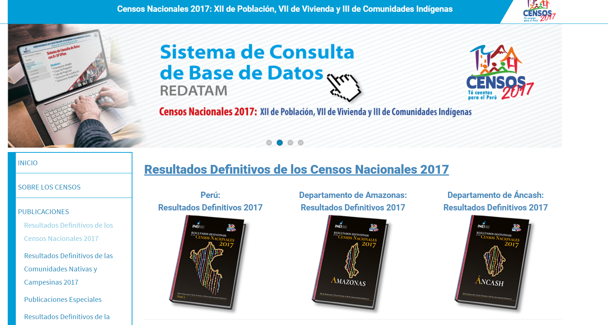
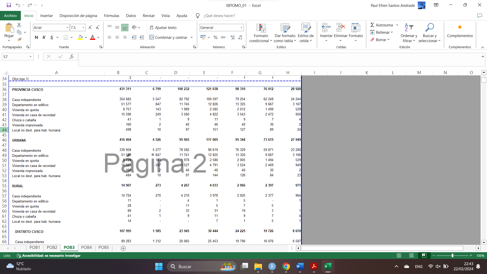

```{r, include = FALSE}
knitr::opts_chunk$set(
  collapse = TRUE,
  comment = "#>"
)
```

La fuente de datos utilizada para el desarrollo del paquete `perucenso` es el Instituto Nacional de Estadística e Informática (INEI) del Perú. El INEI es el organismo encargado de recopilar, procesar y difundir información estadística oficial en el país.

El método de recolección de datos utilizado por el INEI para el **Censo de Población y Vivienda 2017**, que es la principal fuente de datos para el paquete `perucenso`, involucró la realización de un censo a nivel nacional. Este censo implicó la recolección de información a través de entrevistas directas realizadas a los habitantes del país, así como la recopilación de datos a nivel de viviendas y hogares.

### Datos:

Los datos recopilados abarcan una diversidad de aspectos demográficos, socioeconómicos y geográficos. Con el propósito de ofrecer una comprensión de la estructura y el contenido de las tablas de datos producidas por el Instituto Nacional de Estadística e Informática (INEI), se presenta este diccionario de datos.

Este recurso detalla las variables incorporadas en los datos del censo, las cuales abarcan una amplia gama de información. Entre ellas se encuentran datos relacionados con la población, tales como edad, género , entre otros. 

#### Variables geográficas

| Variable          | Nombre/Entidad  |  Tipo  |
|-------------------|-----------------|--------|
| Departamento      | departamento    | texto  |
| Provincia         | provincia       | texto  |
| Distrito          | distrito        | texto  |

### Variables de poblacion

Aquí está la nueva tabla con las columnas solicitadas:


| Variable                                          | Grupo          | Tipo     |
|---------------------------------------------------|----------------|----------|
| Población                                         |                | numérica |
| P: Relación de parentesco con el jefe del hogar   |                | numérica |
| P: Sexo                                           | SEXO           | numérica |
| P: Edad en años                                   | EDAD           | numérica |
| P: Población afiliada: al SIS                     | SEGURO         | numérica |
| P: Población afiliada: a EsSalud                  | SEGURO         | numérica |
| P: Población afiliada: a seguro de fuerzas arm..  | SEGURO         | numérica |
| P: Población afiliada: a seguro privado de salud  | SEGURO         | numérica |
| P: Población afiliada: a otro seguro              | SEGURO         | numérica |
| P: Población afiliada: a ningún seguro            | SEGURO         | numérica |
| P: Población con discapacidad: Ver                | DISCAPACIDAD   | numérica |
| P: Población con discapacidad: Oír                | DISCAPACIDAD   | numérica |
| P: Población con discapacidad: Hablar             | DISCAPACIDAD   | numérica |
| P: Población con discapacidad: Moverse o camin..  | DISCAPACIDAD   | numérica |
| P: Población con discapacidad: Entender o apr..   | DISCAPACIDAD   | numérica |
| P: Población con discapacidad: Relacionarse c..   | DISCAPACIDAD   | numérica |
| P: Población con discapacidad: Ninguna            | DISCAPACIDAD   | numérica |
| P: Tipo de documento nacional de identidad        | IDENTIDAD      | numérica |


### Gestión:

Los datos son presentados a través de la plataforma oficial del Instituto Nacional de Estadística e Informática [INEI](https://censo2017.inei.gob.pe/resultados-definitivos-de-los-censos-nacionales-2017/). En esta plataforma, se pueden encontrar los resultados definitivos del censo, ordenados para cada uno de lso departamentos, presentando un documento en formato pdf y un archivo en formato excel con los datos. Los usuarios pueden explorar y descargar estos datos para su análisis y uso posterior.



Los datos se encuentran disponibles en formato Excel editable, con aproximadamente 15 documentos Excel para cada uno de los departamentos. Cada uno de estos archivos Excel contiene múltiples páginas, las cuales albergan la información correspondiente a diversos aspectos considerados en el censo. La estructura de los datos sigue el siguiente formato:





El proceso de ordenamiento de los datos presentados en estas tablas conlleva numerosas complicaciones que dificultan su análisis. Entre las dificultades destacadas se encuentra el agrupamiento repetitivo de las diferentes escalas de evaluación.

#### Cómo los datos serán organizados:

La organización final de los datos se ajustará a los principios de datos ordenados (tidy data), tal como se describe en la publicación ~Tidy Data~ [Wickham, H. .2014](https://vita.had.co.nz/papers/tidy-data.pdf). Tidy Data es una manera estándar de mapear el significado de un conjunto de datos, lo que permite una fácil interpretación y análisis. En los datos ordenados:

> 1. **Cada variable forma una columna**: Esto significa que cada atributo o característica que se está midiendo tendrá su propia columna en el conjunto de datos, lo que facilita el análisis sistemático.

> 2. **Cada observación forma una fila**: Cada instancia u observación registrada estará representada por una sola fila en el conjunto de datos, garantizando que los puntos de datos estén organizados de manera sistemática.

> 3. **Cada unidad de observación ocupa una celda **: El conjunto de datos se estructurará de manera que cada tipo distinto de observación se almacene en su propia tabla, simplificando el proceso de extracción de información relevante.

{ width=80% }


Bajo estos lineamientos y con la ayuda de las funciones de perucenso, podemos generar tablas ordenadas como la siguiente:

```r
get_tab_10("rawdata/08TOMO_02.xlsx", 
+            sheet = 5, dep_name = "CUSCO")

# A tibble: 15,575 × 8
   dep_name provincia distrito distribucion sexo    rango_etareo     dificultad                    poblacion
   <chr>    <chr>     <chr>    <chr>        <chr>   <chr>            <chr>                             <dbl>
 1 CUSCO    CUSCO     CUSCO    URBANA       Hombres Menores de 1 año Ver, aún usando anteojos             NA
 2 CUSCO    CUSCO     CUSCO    URBANA       Hombres Menores de 1 año Oír, aún usando audífonos            NA
 3 CUSCO    CUSCO     CUSCO    URBANA       Hombres Menores de 1 año Hablar o comunicarse, aún us…         3
 4 CUSCO    CUSCO     CUSCO    URBANA       Hombres Menores de 1 año Moverse o caminar para usar …         8
 5 CUSCO    CUSCO     CUSCO    URBANA       Hombres Menores de 1 año Entender o aprender (concent…         2
 6 CUSCO    CUSCO     CUSCO    URBANA       Hombres Menores de 1 año Relacionarse con los demás p…        NA
 7 CUSCO    CUSCO     CUSCO    URBANA       Hombres Menores de 1 año Ninguna                             788
 8 CUSCO    CUSCO     CUSCO    URBANA       Hombres 1 a 5 años       Ver, aún usando anteojos             21
 9 CUSCO    CUSCO     CUSCO    URBANA       Hombres 1 a 5 años       Oír, aún usando audífonos             9
10 CUSCO    CUSCO     CUSCO    URBANA       Hombres 1 a 5 años       Hablar o comunicarse, aún us…        43
# ℹ 15,565 more rows
# ℹ Use `print(n = ...)` to see more rows

```

### Entorno computacional:

- **Lenguaje de programación:** Con el objetivo de garantizar una gestión eficiente de la información, se han desarrollado una serie de funciones utilizando el lenguaje de programación R, las cuales han sido organizadas como un paquete bajo el nombre de `perucenso`.

- **Paquetes y librerías requeridos (Dependencias):** Para llevar a cabo las tareas de procesamiento y ordenamiento de los datos, se aprovecha la amplia funcionalidad de los paquetes que forman parte de [tidyverse](https://github.com/tidyverse/tidyverse). Además, la visualización se realiza con la ayuda del paquete [sf](https://github.com/r-spatial/sf), y el acceso a la información espacial del Perú se desarrolla mediante un paquete en desarrollo complementario a `perucenso` llamado [geoperu](https://github.com/PaulESantos/geoperu).


