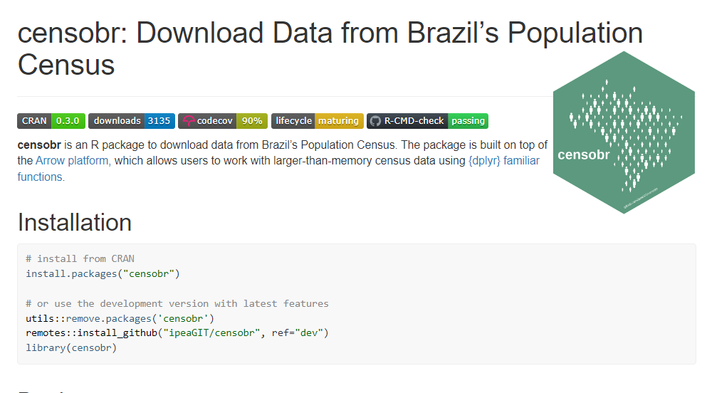
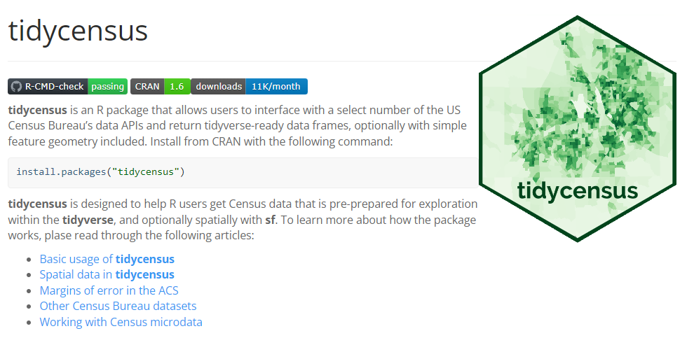

```{r, include = FALSE}
knitr::opts_chunk$set(
  collapse = TRUE,
  comment = "#>"
)
```

### Librerias semejantes

1. [censobr](https://github.com/ipeaGIT/censobr/)

El paquete `censobr` proporsiona una solución integral para el acceso, descarga y análisis de datos del **Censo Demográfico de Brasil**. Este tienen como base la plataforma de `Arrow` y utilizando funciones compatibles con `dplyr`, ha demostrado eficiencia en el manejo de grandes conjuntos de datos censales. Sus capacidades permiten el análisis de variables clave como población, vivienda, educación, economía, entre otras, a diferentes niveles geográficos. Su facilidad para comparar datos entre distintas unidades geográficas y para crear visualizaciones complejas.



2. [tidycensus](https://github.com/walkerke/tidycensus)

Es una herramienta eficiente para acceder y analizar datos del **Censo de los Estados Unidos**, utilizando la API (Interfaz de Programación de Aplicaciones) del Censo y la estructura de `tidyverse`. Su capacidad para acceder a datos de diferentes años, censos y programas del Censo, así como su formato **tidy** que facilita el análisis y visualización, lo hacen destacar. Además, su integración con otras herramientas de `tidyverse` como `ggplot2` y `dplyr` le otorgan flexibilidad y familiaridad. Sin embargo, la limitación en la cobertura de datos y la complejidad de la API del Censo son aspectos a considerar.




3. [censo2017](https://github.com/ropensci/censo2017/)

Desarrollado para brindar acceso a la información del **Censo de Población y Vivienda 2017 de Chile**, "``censo2017` ha proporcionado una solución eficiente para acceder, limpiar y analizar datos censales. Basado en la API del Instituto Nacional de Estadísticas (INE) y en la estructura de `tidyverse`, permite trabajar con datos censales de manera efectiva. Su capacidad para acceder a una amplia gama de datos a diferentes niveles geográficos y su formato **tidy** han simplificado el análisis. Sin embargo, la limitación en la cobertura de datos y la complejidad de la API del INE han sido desafíos a superar.


